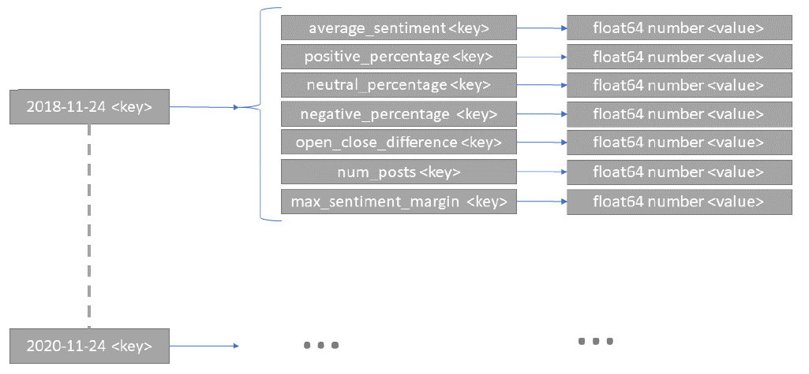
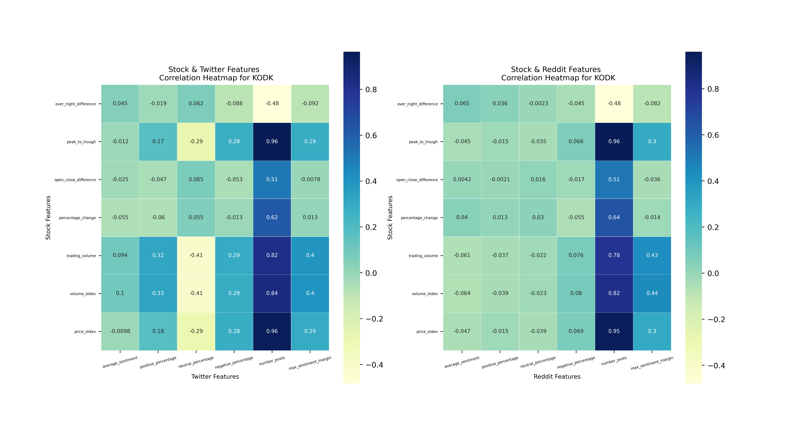
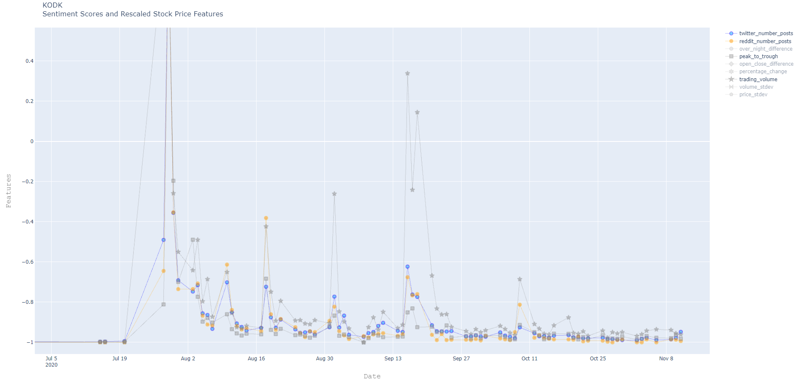

# Social Media Sentiment Analysis and Stock Volatility

The influence of social media sentiment on the stock market is analysed
in this project. 

## Data Structures

For a given stock ticker, historical stock price data are pulled from the 
AlphaVantage API and saved as a csv file. From the stock data, 
a number of different features are calculated. Those features are the
*start-time* and *end-time* considered every day 
(usually 9Am to 5PM), the *over-night-price-difference*, 
*peak-to-trough*, *open-close-difference*, *price-percentage-change*, 
*trading-volume*, *trading-volume-standard-deviation* and the 
*price-standard-deviation*.  
Those features are calculated and stored in 
nested hash tables with the structure shown below:

Similarly, Reddit and Twitter social media posts are downloaded
and their sentiment is predicted with the FinBERT NLP 
deep learning model. The following sentiment features are extracted
from Twitter and Reddit posts: *average-sentiment*, 
*number-positive-posts-percentage*, 
*number-negative-posts-percentage*, 
*number-neutral-posts-percentage*,
*open-close-sentiment-difference*, 
*number-of-posts*, 
*max-sentiment-margin*

## Results

Statistical test, plots and correlations are calculated and created
for a number of different combinations of these feature sets.
A subset of the analysed stock ticker results is stored in the 
*results* folder.
A correlation heatmap for Kodak (KODK) may look like this:

To show developments over the time, interactive Plotly graphics are
created. For KODK they may look like this:

## Setup

A file called *local_config.py* with the following structure should
be created:

    import os
    
    
    class LocalConfig:
    
        # CPU count
        NUM_CPUs = os.cpu_count() - 2
    
        # Stock Pulling API
        ALPHA_VANTAGE_API_KEY_EXTENDED_HISTORY = 'XXX'
    
        # Data base path
        DATA_BASE_PATH = 'XXX'
    
        # Programming outputs base path
        PROGRAMMING_OUTPUTS_BASE_PATH = 'XXX'

In the *execution_files* folder, there is a file called
*execution_parameters* in which the ticker should be specified.
After that, the *main* function can be called.

Currently, reddit, twitter and stock feature hash tables are uploaded
into the *feature_dictionaries* directory for a small number of tickers 
and those tickers should be used. The integration of FinBERT into 
this repository to have everything in one place will be done
in the future. 
 

